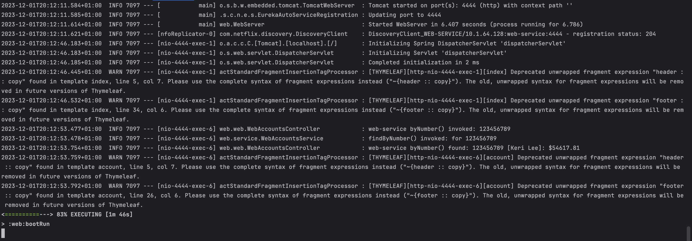
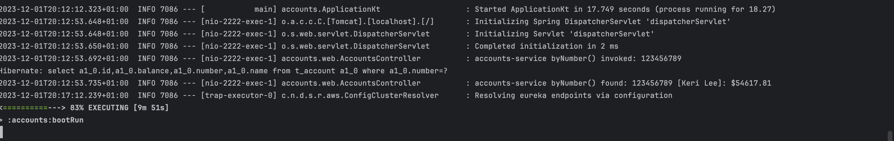
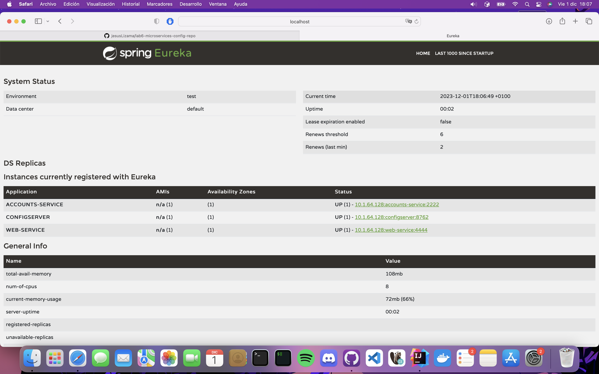
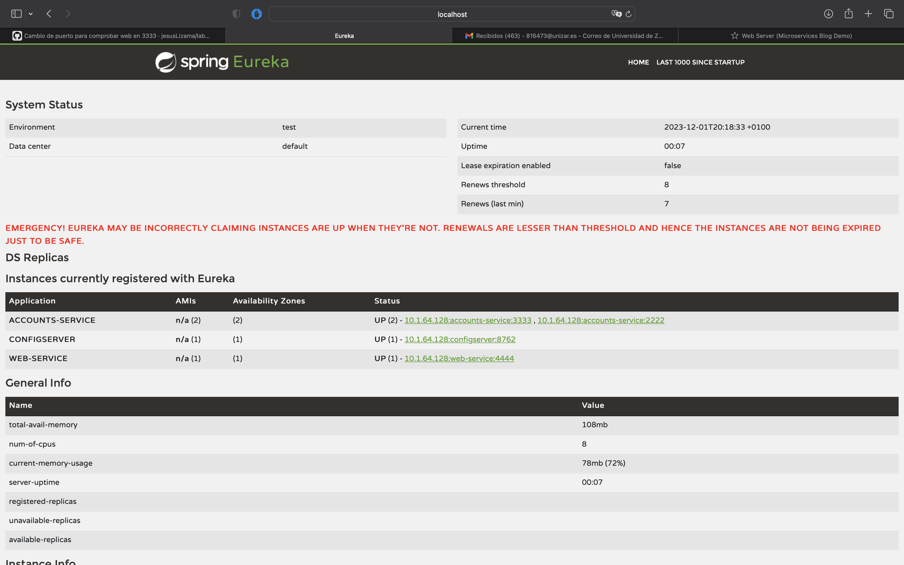
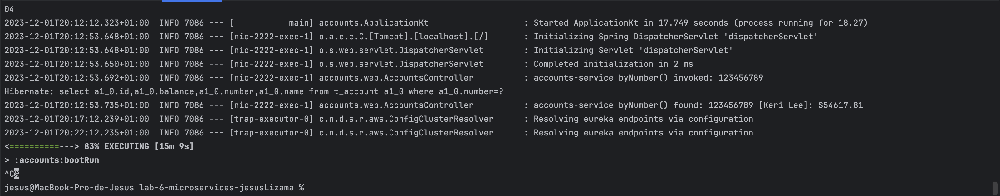
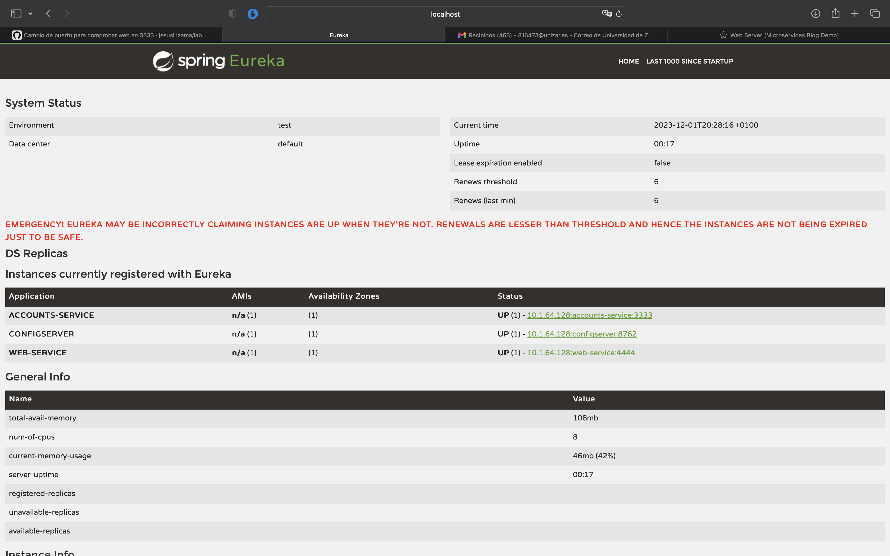
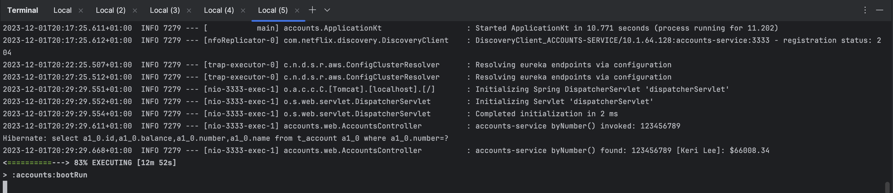
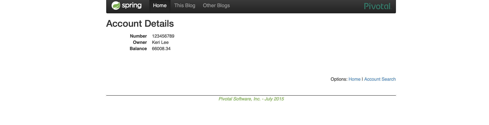

# Configuration for Lab 6

The objective is to show that the following activities have been accomplished:

- Create your own configuration repository based on <https://github.com/UNIZAR-30246-WebEngineering/lab6-microservices-config-repo>
  and update the configuration of your service `config` to use it. **Link to the repository**.

El link al repositorio es el siguiente:
  https://github.com/jesusLizama/lab6-microservices-config-repo.git

- Two services `accounts (2222)` and `web` are running and registered (two terminals). **2 Log screenshot**.

Hemos lanzado tanto el account como el web, y hemos accedido mediante la url al puerto 4444, el 
cual es el correspondiente al de web. Hemos realizado una peticion y vemos en los logs la peticion 
correspondiente como no salta excepcion, con lo cual ambos estan corriendo.

Imagen correspondiente de la terminal de web es la siguiente:

Imagen desde la perspectiva del account:

- The service registration service has these two services registered (a third terminal). **Eureka dashboard screenshot**.
  

- Update the configuration repository so that the `accounts` service uses now the port 3333. **Link to the commit**.
  https://github.com/jesusLizama/lab6-microservices-config-repo/commit/b394e142e5d6f90f11bd0e12a93e2b6c97e57e75

- Run a second instance of the `accounts` service using the new configuration (a fourth terminals). What happens? **Explain and Eureka dashboard screenshot**
Aqui insertamos la captura del Eureka dashboard, con los dos account corriendo juntos:
  
- 
Como podemos observar, hemos conseguido correr dos account SIN TENER QUE DETENER la configuracion, es decir, habia uno corriendo 
en el puerto 2222 y hemos creado otro en el puerto 3333 y ha funcionado.

- What happens when you kill the service `accounts (2222)` and do requests to `web`?. **Explain and screenshots, including at least one Eureka dashboard screenshot**

Si matas el accounts del puerto 2222, desaparece y solo queda corriendo el del puerto 3333. Con lo cual, si volvemos a hacer una peticion desde web y no
salta ninguna excepcion en los Logs es que ha conseguido cambiar correctamente y no ha sido necesario detener nada para que siguiese funcionando.

Imagen de como lo matamos:

Imagen del dashBoard Eureka tras el kill:

Imagen correspondiente de la terminal de web tras la nueva peticion:

- Can the web service provide information about the accounts again?. Why? **Explain and screenshots, including at least one Eureka dashboard screenshot** 

Si, el web puede seguir obteniendo la informacion como se ve a continuacion:

Es capaz de devolver la informacion porque el cambio se ha realizado correctamente, tal y como hemos visto en las imagenes anteriores.