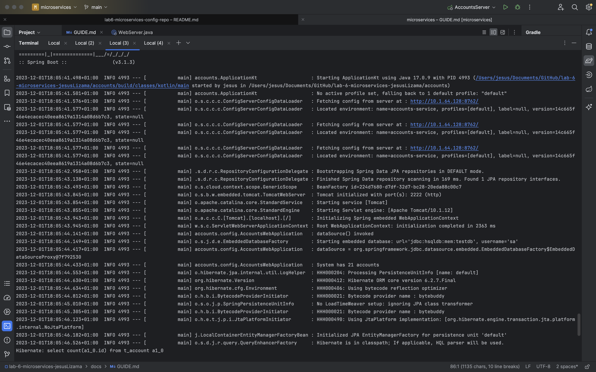
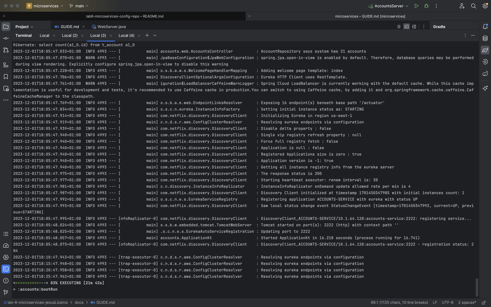
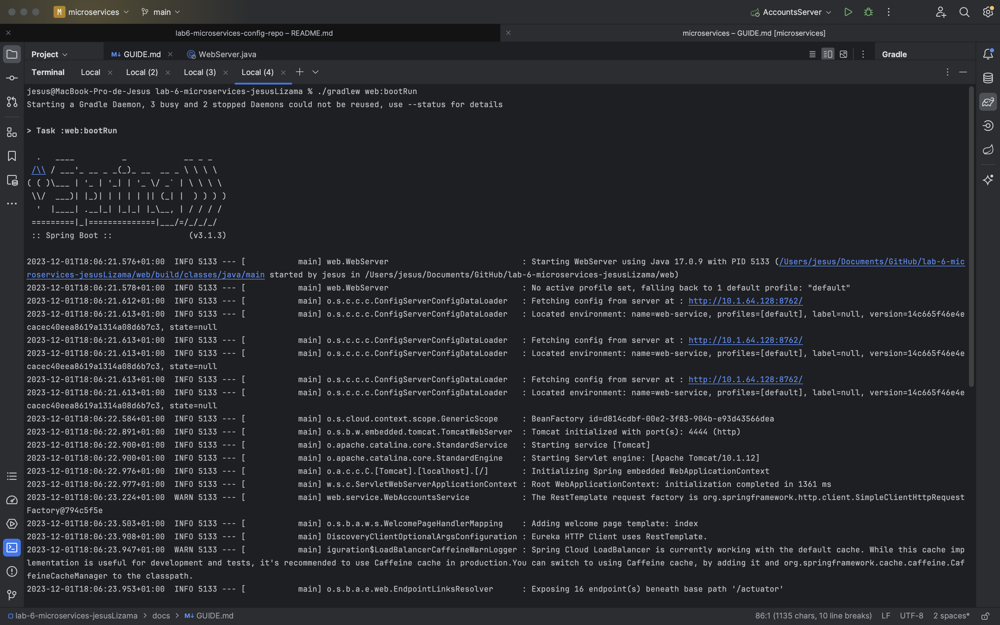
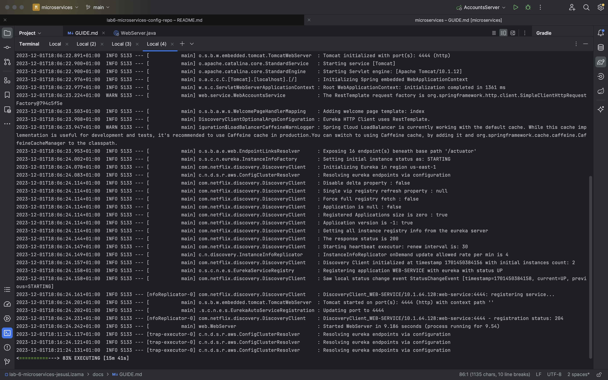

# Configuration for Lab 6

The objective is to show that the following activities have been accomplished:

- Create your own configuration repository based on <https://github.com/UNIZAR-30246-WebEngineering/lab6-microservices-config-repo>
  and update the configuration of your service `config` to use it. **Link to the repository**.
- 
El link al repositorio es el sigueinte:
  https://github.com/jesusLizama/lab6-microservices-config-repo.git

- Two services `accounts (2222)` and `web` are running and registered (two terminals). **2 Log screenshot**.

Los logs completo de la terminal de accounts es el siguiente:

Los logs completo de la terminal de accounts es el siguiente:

- The service registration service has these two services registered (a third terminal). **Eureka dashboard screenshot**.
  

- Update the configuration repository so that the `accounts` service uses now the port 3333. **Link to the commit**.

- Run a second instance of the `accounts` service using the new configuration (a fourth terminals). What happens? **Explain and Eureka dashboard screenshot**

- What happens when you kill the service `accounts (2222)` and do requests to `web`?. **Explain and screenshots, including at least one Eureka dashboard screenshot**
- 
- Can the web service provide information about the accounts again?. Why? **Explain and screenshots, including at least one Eureka dashboard screenshot** 
