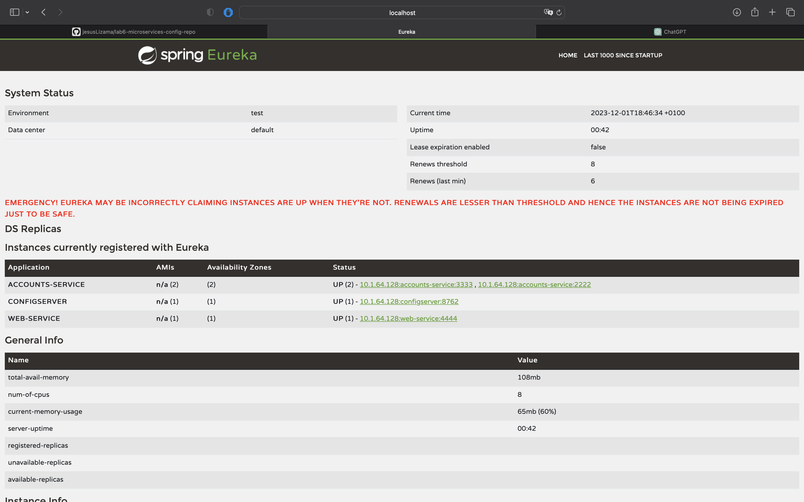

# Configuration for Lab 6

The objective is to show that the following activities have been accomplished:

- Create your own configuration repository based on <https://github.com/UNIZAR-30246-WebEngineering/lab6-microservices-config-repo>
  and update the configuration of your service `config` to use it. **Link to the repository**.

El link al repositorio es el siguiente:
  https://github.com/jesusLizama/lab6-microservices-config-repo.git

- Two services `accounts (2222)` and `web` are running and registered (two terminals). **2 Log screenshot**.

Hemos lanzado tanto el account como el web, y hemos accedido mediante la url al puerto 4444, el 
cual es el correspondiente al de web. Hemos realizado una peticion y vemos en los logs la peticion 
correspondiente como no salta excepcion, con lo cual ambos estan corriendo.

Imagen correspondiente de la terminal de web es la siguiente:

- The service registration service has these two services registered (a third terminal). **Eureka dashboard screenshot**.
  

- Update the configuration repository so that the `accounts` service uses now the port 3333. **Link to the commit**.
  https://github.com/UNIZAR-30246-WebEngineering/lab6-microservices-config-repo/commit/68d57f0842bb6fb941a2db700e0b2994ccbec593

- Run a second instance of the `accounts` service using the new configuration (a fourth terminals). What happens? **Explain and Eureka dashboard screenshot**
Aqui insertamos la captura del Eureka dashboard, con los dos account corriendo juntos:
  
Como podemos observar, hemos conseguido correr dos servicios account sin tener que detener la configuracion, es decir, habia uno corriendo 
en el puerto 2222 y hemos cambiado al 3333 y ha funcionado.

- What happens when you kill the service `accounts (2222)` and do requests to `web`?. **Explain and screenshots, including at least one Eureka dashboard screenshot**
Si matas el accounts en el puerto 2222, desaparece y solo queda correindo el del puerto 3333. Con lo cual, si tenemos ambos correindo eurica 
- tiene un momento en el que estan correindo ambos, si depsues matas el del 2222, se queda solo el del 333 y eurica asigna automaticamente a el,
- con lo cual 

- Can the web service provide information about the accounts again?. Why? **Explain and screenshots, including at least one Eureka dashboard screenshot** 
